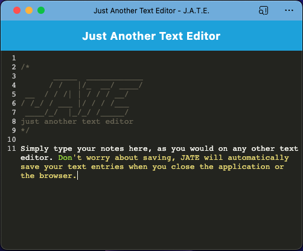

# Just Another Text Editor 

## Description

Just Another Text Editor is a Progressive Web App that does one thing: it maintains a one-page notepad that will keep track of the user's input, even if they are offline.

As a PWA, Just Another Text Editor utilizes a service worker and IndexedDB storage to operate as a standalone app without a network connection.

## Table of Contents

- [Installation Instructions](#installation-instructions)
- [Usage Information](#usage-information)
- [Credits](#credits)
- [Software License](#software-license)
- [Contact the Developer](#questions)

## Installation Instructions

The user can access Just Another Text Editor via a web browser [here on Heroku](https://developer.chrome.com/docs/workbox/). They can install it as a PWA via any browser with that technology enabled. Either utilize the browser's native application saver, or click the "Install" button in the main application window. They can now access the application via their browser's app menu or via whatever app icon that the browser creates.

Note: Just Another Text Editor relies on the use of service workers and IndexedDB to operate. Most modern browsers do support these technologies on both desktop and mobile, though most older versions do not.

## Usage Information

Interaction with Just Another Text Editor as either a website or a Progressive Web App is simple: just click to create a cursor location as one would in a text document, and type. The content is automatically saved when the user clicks anywhere except the text window, even if it is just to close the window.

## Credits

The original code for Just Another Text Editor was provided by the staff of the [University of Minnesota Full Stack Coding Boot Camp](https://ccaps.umn.edu/full-stack-web-development-certificate-coding-boot-camp). The PWA code is by Lee Klusky, with much guidance from the staff of the boot camp; documentation at [webpack.org](https://webpack.js.org) and Google's [Chrome Developers website](https://developer.chrome.com/docs/workbox/); and as is often the case, the accumulated wisdom of coders around the Web at places such as [Stack Overflow](https://www.stackoverflow.com) and the [Mozilla Developer Network](https://developer.mozilla.org).

## Software License

©2023, Lee Klusky

This software is covered by a [MIT License](https://opensource.org/licenses/MIT).

Permission is hereby granted, free of charge, to any person obtaining a copy of this software and associated documentation files (the "Software"), to deal in the Software without restriction, including without limitation the rights to use, copy, modify, merge, publish, distribute, sublicense, and/or sell copies of the Software, and to permit persons to whom the Software is furnished to do so, subject to the following conditions:

The above copyright notice and this permission notice shall be included in all copies or substantial portions of the Software.

THE SOFTWARE IS PROVIDED "AS IS", WITHOUT WARRANTY OF ANY KIND, EXPRESS OR IMPLIED, INCLUDING BUT NOT LIMITED TO THE WARRANTIES OF MERCHANTABILITY, FITNESS FOR A PARTICULAR PURPOSE AND NONINFRINGEMENT. IN NO EVENT SHALL THE AUTHORS OR COPYRIGHT HOLDERS BE LIABLE FOR ANY CLAIM, DAMAGES OR OTHER LIABILITY, WHETHER IN AN ACTION OF CONTRACT, TORT OR OTHERWISE, ARISING FROM, OUT OF OR IN CONNECTION WITH THE SOFTWARE OR THE USE OR OTHER DEALINGS IN THE SOFTWARE.

## Questions?

Contact me at <a href="mailto:lkbootcamp@yahoo.com">lkbootcamp@yahoo.com</a>, or visit my [GitHub profile](https://www.github.com/lkalliance).
